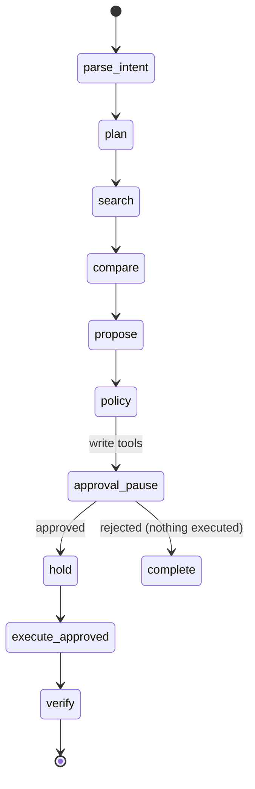

# Extending the Workbench to New Domains (Domain Packs)

> Purpose: describe how to reuse the agent engine for **any** multi-agent solution —
> not just ITOps case investigation. The running example is an end-to-end **travel
> planner** (search flights, plan itinerary, book flight/hotel/cab with human
> approval before any payment).
>
> Rule attached to: `AGENTS.md` pin contract (`skill == contract == tool`) and the
> engine seams below. Engine code must stay ITOps-agnostic; domain logic lives in a
> **domain pack**.

## 1. Model

The workbench is ~80% generic agentic-stack, ~20% ITOps. The generic part is the
**engine**; the ITOps part is the default **domain pack**. To build a new solution
(flights, e-commerce, field service, legal review, …) you additive-mount a new pack
and leave the engine alone.

```
agent-workbench/
  apps/            core engine (gateway, orchestrator machinery, MCP + A2A gateways)
  packages/        core engine libs (contracts, security, persistence, telemetry, protocols)
  engine/          # NEW: pack registry + WorkflowSpec interface (see §2)
  domain_packs/
    itops/         the current repo domain, promoted to a pack (reference)
    travel/        a second, fully worked example (the reference travel planner)
      contracts.py         # additive schemas (additive to packages/contracts)
      catalog.py           # ToolMetadata registry for the domain
      executors/           # adapters: flight/hotel/cab/payment
      specialists/         # A2A agent cards
      policies.py          # approval + spend + PII rules
      workflow.py          # WorkflowSpec (states, prompts, transition guards)
      skills/              # generated skill-packs (skills/_generator.py)
      fixtures/            # deterministic mock data + FakeRuntime-ish behavior
```

Selection: a single env knob **`DOMAIN_PACK`** (default `itops`) tells the engine
which pack to mount — contracts, catalog, policies, workflow, skills.

## 2. Engine changes (small, additive, non-breaking)

These are the *only* touches to the engine, and each preserves the ITOps pack's
behavior (all current tests stay green).

| # | Change | Why the travel pack needs it |
|---|---|---|
| E1 | Extend `EvidenceKind` enum (`packages/contracts/run.py`) with `offer`, `itinerary`, `payment` | Trip evidence isn't `metric/log/trace/…` |
| E2 | Extend `EvidenceReference.uri` scheme allowlist (`run.py`) with `offer://`, `itinerary://`, `payment://`, `booking://` | Sanitized citations for fare offers and bookings |
| E3 | Introduce `WorkflowSpec` (named states + phase descriptions + transition guards) read by `apps/orchestrator/graph.py`; the 13 hardcoded `STATES` become the itops pack's spec | `classify → correlate` is incident-flavored; travel runs `parse-intent → search → compare → propose → approve → hold → book → verify` |
| E4 | Pack-scoped policy bundle replacing the hardcoded `_SENIOR_TOOLS` / `_DESTRUCTIVE_TOOLS` / `case.approve` sets in `apps/orchestrator/policies.py` | Booking policy is spend/PII based, not prod-rollback based |
| E5 | Pack-scoped scope registry (per-tool `required_scopes` already exists; just don't reuse ITOps scope names) | Clean identity for `travel.book`, `finance.charge` |

Everything else is **used as-is**: run lifecycle + budgets, idempotency keys,
approval rows, SSE/AG-UI eventing, replay, circuit breaker, per-tool timeouts,
OTel tracing, redaction, the `AgentRuntime` protocol seam (ADR-001).

## 3. Travel tool catalog (illustrative `ToolMetadata`)

Register per-tool metadata exactly as `apps/mcp_server/catalog.py` does today.

| Tool | Category | Side effect | Idempotent | Approval | Notes |
|---|---|---|---|---|---|
| `flight.search` | read | none | yes | no | carriers/routes ≤ fixtures |
| `flight.fare.offer` | read | none | yes | no | returns `offer://` evidence |
| `hotel.search` | read | none | yes | no | |
| `cab.estimate` | read | none | yes | no | |
| `itinerary.plan` | analysis | none | yes | no | `supports_dry_run` |
| `itinerary.hold` | write | external_write | yes | no | 24h fare-hold token, no money moved |
| `flight.book` | write | external_write | **no** | **yes** | `requires_approval`, mandatory `idempotency_key` |
| `hotel.book` | write | external_write | no | **yes** | |
| `cab.book` | write | external_write | no | **yes** | |
| `finance.charge` | write | external_write | no | **yes (high)** | card details redacted; `risk=high` forces approval |
| `booking.cancel` | write | external_write | no | **yes** | rides approval-expiry windows |

Three engine behaviors carry the heavy lifting with no modification:

- **Two-phase booking** — `itinerary.hold` (idempotent, no money) → human approve →
  `flight.book` (non-idempotent, money). Mirrors the existing dry-run/simulate →
  execute pattern and the "never auto-retry writes" rule.
- **Budget as trip spend cap** — `max_cost_usd` on `AgentRequest` becomes the trip
  budget; already enforced before each billable step.
- **Idempotency** — `ProposedAction.idempotency_key` + `Idempotency-Key` header are
  mandatory for exactly this: double-booking protection.

## 4. A2A specialists

New agents under `apps/a2a_agents/` copying the observability agent's shape
(Agent Card, `A2ATaskRequest/Result`, `deadline`/timeout, structured errors,
read-only posture):

- `travel.flight-search`
- `travel.hotel-search`
- `travel.cab-router`
- `travel.itinerary-planner` — the "correlator": merges evidence, detects conflicts
  (closed fare window, hotel–cab mismatch), emits findings + unresolved questions
- `travel.booking-executor` — runs the approved book/charge sequence

Delegation, "A2A output is untrusted" conflict-checking, and schema-validated
outputs carry over unchanged.

## 5. Policy bundle (`travel/policies.py`)

Author rules against the existing contract-typed `evaluate_action` signature:

- **Scopes** — `travel.book`, `travel.hold`, `finance.charge`, `booking.cancel`.
- **Deny-by-default** — any tool outside the travel catalog → denied (same as today).
- **Spend gate** — cumulative `finance.charge` per run may not exceed the run budget;
  per-ticket value caps.
- **PII gate** — passenger details (passport, card PAN) must be redacted in evidence;
  full payloads only under an explicit audit policy (reuses `packages/security/redaction`
  and `EvidenceReference.excerpt_hash`).
- **High-risk** — `finance.charge` and `booking.cancel` force `risk=high`, so the
  contract validator (`ProposedAction._high_risk_needs_approval`) already mandates approval.
- **Expiry** — holds expire via the existing approval-expiry window; a booking is
  never possible after a fare window closes.

## 6. Workflow spec (`travel/workflow.py`)

Replace the incident `STATES` list via `WorkflowSpec` (E3):

```
parse-intent → plan → search → compare → propose(itinerary + bookings)
→ policy → approval_pause → hold → execute_approved(book/charge) → verify → complete
```

Semantic alignment with the existing engine so every governor still applies:

| Travel phase | Engine analog | Reused machinery |
|---|---|---|
| parse-intent | classify | budgets, model routing |
| search → compare | resources → mcp_reads → a2a_delegate | read-attempt/retry rules |
| propose | findings → propose | `ProposedAction` validation |
| hold | execute_approved (dry) | idempotent-write safety |
| book / charge | execute_approved (real) | approval row checked, no auto-retry |



## 7. Skills / AGENTS.md

`skills/_generator.py` already renders pack skills from contracts — the travel pack
regenerates its own `SKILL.md`s + `AGENTS.md` the same way (`skills/travel/*`:
`plan-trip`, `book-travel`, `manage-booking`), keeping `skill == contract == tool`
pinned. The unmanaged / BYO-agent mode therefore works unchanged for travel too.

## 8. Recipe for the community

To publish a new solution pack:

1. **Copy the travel pack** → `domain_packs/<yourdomain>/`.
2. **Redefine** `catalog.py`, `executors/`, `specialists/`, `policies.py`,
   `workflow.py`, `skills/`, `fixtures/`.
3. **Add additive contract schemas** under `packages/contracts/` (name them with
   your domain; never rename or remove existing models).
4. **Leave `apps/` and engine libs untouched** — only E1–E5 from §2 are pre-approved
   engine touches, and they are domain-agnostic.
5. **Match the local mock contract**: `DOMAIN_PACK=<yourdomain>` + `LLM_MODE=fake` +
   compose service mirrors so `make up && make migrate && make test` stays green
   without real credentials.

Publishing note: keep the itops pack as the *reference implementation* (it pins the
engine seams); travel exists to prove the pattern works end-to-end.