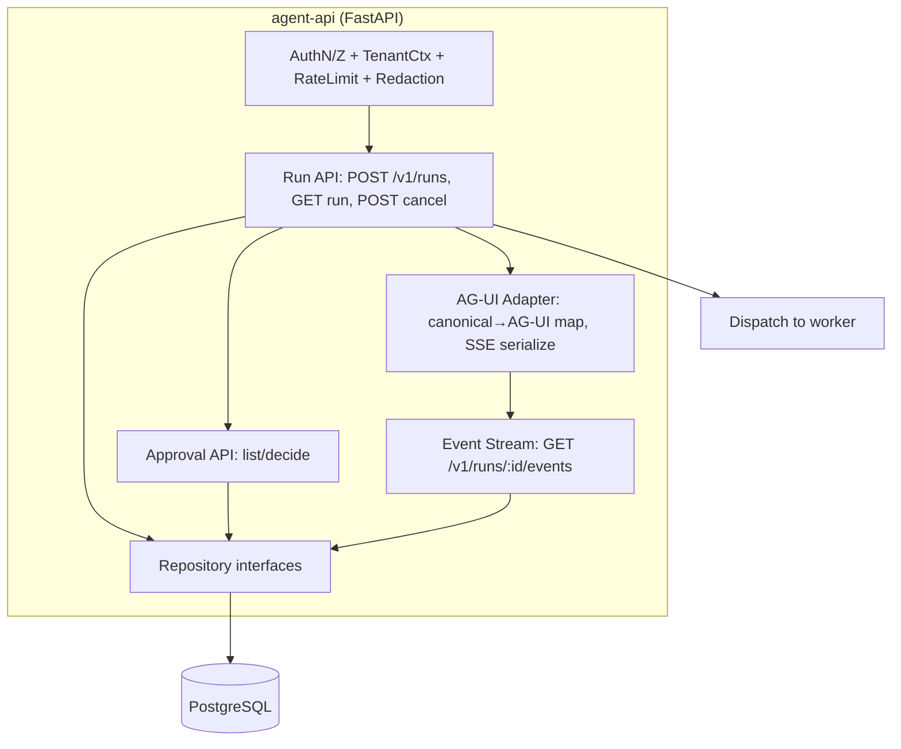
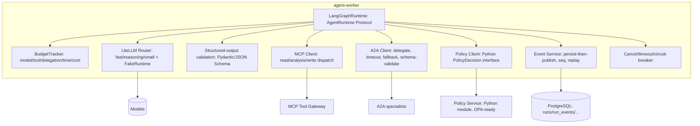

# Component Diagram — Agent Gateway + Orchestrator (C4 L3)

> Spec §2.1, §5. Bounded graph; `AgentRuntime` Protocol; server-side policy/approval/durability.

## API (apps/api)

## Orchestrator / Worker (apps/orchestrator + apps/worker)

## MCP server (apps/mcp_server)

Components: `Transport (Streamable HTTP + auth)` → `Tool Registry (metadata: category/side_effect/idempotent/timeout/scopes/approval/dry_run/owner/version)` → `Read tools` / `Analysis tools` / `Write+Destructive tools (allowlist, idempotency, dry-run)` → `Resources (services/runbooks)` → `Prompts (investigate-incident, summarize-evidence, prepare-change-review)` → `Enterprise adapters (mock local)`; cross-cutting: tenant/resource authZ, audit records, OTel spans, redaction.

## Packages (shared)

`packages/contracts` (versioned Pydantic, JSON Schema), `packages/protocols` (ag_ui, mcp_client, a2a_client), `packages/llm` (client/router/cost), `packages/security` (identity/authorization/redaction), `packages/persistence` (models/repos/migrations), `packages/telemetry` (tracing/metrics/conventions adapter).

## Bounded workflow states (§5.1)

`classify → plan → retrieve context → read-only diagnostics → A2A delegate → correlate → recommend → policy eval → approval gate → execute approved → verify → complete`, with branches: insufficient context→clarify; low confidence→more info; denied→explain; rejected→complete-with-rejection. Persist + emit event on every transition; enforce max duration/model-calls/tool-calls/delegation-depth/tokens; retry safe+idempotent only, never auto-retry irreversible tools.
