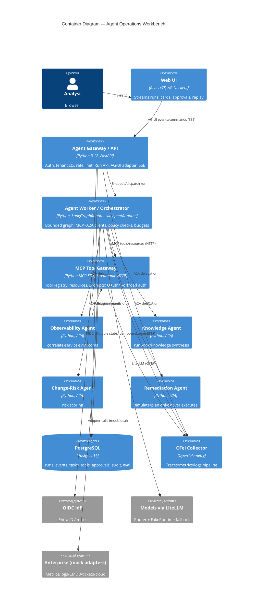

# Container Diagram — Agent Operations Workbench (C4 L2)

> Spec §2–§3, §11. Locked: FastAPI Gateway + worker, MCP server (Streamable HTTP), A2A specialists, PostgreSQL, React+TS UI, OTel Collector, Docker Compose local / Helm AKS.

## Containers & responsibilities (§3.1)

| Container / image | Code boundary | Scales | Notes |
|---|---|---|---|
| `agent-api` (FastAPI) | `apps/api` — auth, run creation, SSE stream, AG-UI map, approval endpoints | HPA independent | Stateless; durable state in PG |
| `agent-worker` | `apps/orchestrator` + `apps/worker` — graph, budgets, MCP/A2A clients, policy, event publish | HPA + concurrency limits | Persist after every transition; idempotency keys |
| `agent-mcp-server` | `apps/mcp_server` — tools/resources/prompts, tenant+scope authZ | HPA independent | Streamable HTTP + Origin check + OAuth/workload; read vs write split |
| `agent-observability-agent`, `agent-knowledge-agent` (+ change-risk, remediation) | `apps/a2a_agents/*` | HPA / scale-to-zero optional | Agent Card + versioned I/O; deterministic local mode |
| `agent-ui` | `ui/web` | CDN/static | Never coupled to orchestrator internals; tolerates unknown events |
| `postgres` | `packages/persistence` migrations | StatefulSet / Azure DB for PG in prod | Unique `(run_id, sequence)`; hashes + redacted payloads |
| `otel-collector` + jaeger/prom/grafana | `deploy/otel-collector` | infra | W3C propagation; GenAI attrs behind adapter |

## Deployments

- **Local:** Docker Compose services `api, worker, mcp-server, observability-agent, postgres, otel-collector, jaeger, prometheus, grafana, ui` (§11.3), all on mock adapters + FakeRuntime.
- **AKS:** Helm chart per service (Deployment/Service/HPA/PDB/ServiceAccount/NetworkPolicy/ConfigMap/Secret/liveness+readiness/resources per §11.2), hardened images (non-root, RO fs, dropped caps, SBOM, signed, scanned).

## Key flows

1. `POST /v1/runs` → persist `runs` row → worker executes bounded graph (§5.1) → canonical events → PG + SSE (AG-UI mapped at API boundary).
2. Read tools auto; write/destructive → policy eval → `approval.required` → human → execute with idempotency key + dry-run where supported.
3. Reconnect: `GET /v1/runs/{id}/events?after_sequence=N` (+ `Last-Event-ID`), terminal event if done.
