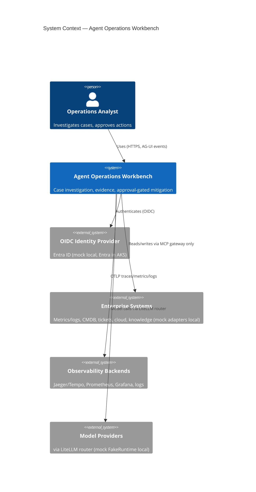

# Context — Agent Operations Workbench (C4 L1)

> Spec: `Re-ARch-Agentic.md` §1–§2. Locked stack: Python 3.12 + FastAPI + PostgreSQL, React+TS UI, LangGraph default runtime behind `AgentRuntime` Protocol, LiteLLM router + FakeRuntime, Python policy (OPA-ready), Docker Compose local + Helm/AKS, mock enterprise adapters local.

## Purpose

Enable an operations analyst to investigate an incident/service case, gather evidence from enterprise systems, request specialist analysis, and produce a recommended resolution with explicit human approval before any consequential action (§1.2–§1.3). Reusable for IT incidents, support cases, cloud troubleshooting, security triage, SRE runbooks, knowledge assistants, reliability copilots.

## Users & external systems

| Actor / System | Interacts via | Notes |
|---|---|---|
| Operations analyst (Zone 1) | React+TS Web UI (AG-UI client) | Creates runs, streams findings, approves/rejects, cancels, replays |
| OIDC IdP (Entra ID local-mock / Entra ID in AKS) | Agent Gateway auth middleware | User auth; service identity via workload identity in AKS |
| Enterprise systems (Zone 4, mocked locally) | Only via MCP Tool Gateway adapters | Metrics/logs/traces, CMDB/service metadata, ticketing, cloud APIs, knowledge search |
| Specialist orgs (logical externals, in-repo impl initially) | Only via A2A | observability / knowledge / change-risk / remediation agents |
| Telemetry backends (Zone 5) | OTLP via Collector | Jaeger/Tempo + Prometheus + Grafana + logs (local); Azure Monitor exporter option in AKS |
| Policy admin | Policy bundle / Python module config | Authors/approves Rego-equivalent Python rules; OPA-ready |

## Context diagram (mermaid)

## Trust-zone crossings

Zones per §10.1: Z1 User/UI → Z2 API+orchestrator → Z3 MCP/A2A endpoints → Z4 enterprise → Z5 telemetry/audit. Every crossing enforces authN/authZ, validation, rate limit, timeout, trace propagation, audit logging. See `security-model.md`.

## Dual consumption (summary)

1. **Managed runtime:** UI + Gateway + LangGraphRuntime (default `AgentRuntime`) + LiteLLM.
2. **Portable skill-pack:** `AGENTS.md` + `skills/*/SKILL.md` — no `langgraph` client dependency; calls same versioned Gateway/MCP/A2A HTTP APIs. Skills are generated views of contracts; server enforces policy/approval/durability. Pin rule: `skill == contract == tool` (see `skill-consumption.md`).

## Non-goals (W1)

No real enterprise credentials, no Kafka/ServiceBus (Postgres polling first), no full OPA sidecar (Python interface + OPA-ready shape), no multi-region DR.
