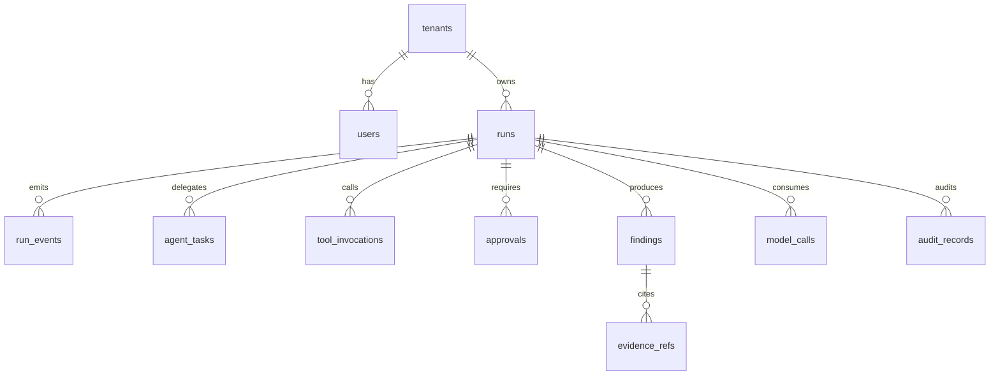

# Domain Model

> Spec §4 (+ §9 persistence, §10.2 policy). All models versioned Pydantic in `packages/contracts` with JSON Schema; `tenant_id/run_id/trace_id/correlation_id` where relevant; reject unknown fields where safe (see `api-contracts.md`).

## Run lifecycle

`RunStatus: created → running → waiting_for_approval → running → completed | failed | cancelled`. `RUNNING` covers graph transitions; approval pause is explicit `WAITING_FOR_APPROVAL` with `approval-wait` span.

| Model | Key fields | Invariants |
|---|---|---|
| `AgentRequest` | `run_id, tenant_id, user_id, objective, context{}, max_tool_calls=20, max_model_calls=10, max_cost_usd=2.0, schema_version` | Budgets enforced by worker; `objective` length-capped; context size-capped |
| `Run` | `id, tenant_id, created_by, objective, status, current_state, budget_json, created_at/updated_at/completed_at` | Tenant-isolated; state persisted after every transition |
| `Finding` | `title, summary, evidence_refs[], confidence 0–1, severity?` | Every material finding cites ≥1 `EvidenceReference` |
| `EvidenceReference` | `ref_id, kind (metric/log/trace/doc/runbook/agent), uri, excerpt_hash, span_ref?` | Excerpts redacted; hashes stored; raw content by audit policy only |
| `ProposedAction` | `action_id, tool_name, reason, input{}, risk, requires_approval=true, rollback?, dry_run?, idempotency_key` | Never built from raw model text; validated against tool schema; write/destructive default `requires_approval=true` |
| `Approval` | `approval_id, run_id, action_id, requested_by, approver?, decision (pending/approved/rejected/expired), reason?, decided_at?` | Human decision persisted; expiry enforced; terminal actions check approval row, not event stream |
| `PolicyDecision` | `allowed, requires_approval, reason, required_scopes[], max_impact?` | Pure function of (principal, action, context); span + audit record |
| `ToolMetadata` | `name, description, category (read/analysis/write/destructive), side_effect, idempotent, timeout_seconds, required_scopes[], approval_required, supports_dry_run, owner, version` | `skill==contract==tool` pin target (see `skill-consumption.md`) |
| `ToolInvocation` | `id, run_id, tool_name, tool_version, input_hash, redacted_input_json, output_hash, status, authorization_decision, idempotency_key, started/completed_at` | Hashes + redacted by default; full payloads only under explicit audit policy |
| `A2ATaskRequest/Result` | `task_id, skill_id, objective, inputs{}, callback_url?, deadline` / `task_id, status, output?, artifacts[], error?` | Output schema-validated; treated as untrusted evidence until correlated |
| `AgentEvent` | `event_id, run_id, sequence, type, timestamp, data{}, trace_id?, sensitive=false` | `EventType`: `run.started, message.delta, tool.started/completed, agent.delegated, finding.created, approval.required/received, run.completed/failed`; `(run_id, sequence)` unique; persist-then-publish |
| `ErrorEnvelope` | `code, message (safe), run_id?, retryable, details? (redacted)` | Consistent across REST/MCP/A2A/SSE |

## ER sketch (→ §9 tables)

